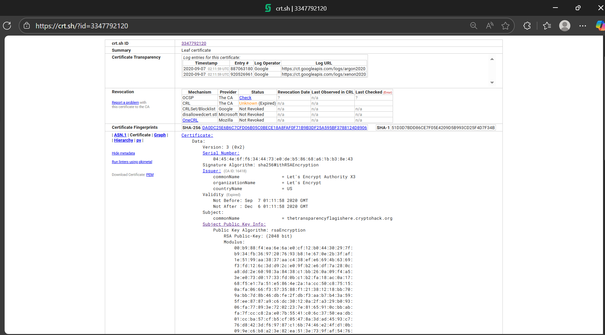

# Writeup: Transparency

## Đề bài
Đề bài cho một file transparency.pem và yêu cầu tìm một subdomain của `cryptohack.org` đang sử dụng khóa này trong chứng chỉ TLS của nó.

## Cách giải
- Tìm giá trị của public key dưới dạng sha256 bằng Python.

```python
from Crypto.PublicKey import RSA
import hashlib 

rsa_data = """-----BEGIN PUBLIC KEY-----
MIIBIjANBgkqhkiG9w0BAQEFAAOCAQ8AMIIBCgKCAQEAuYj06m5q4M8SsEQwKX+5
NPs2lyB2k7geZw4rP68eUZmqODeqxDjv5mlLY2nz/RJsPdks4J+y5t96KAyo3S5g
mDqEOMG7JgoJ9KU+4HPQFzP9C8Gy+hisChdo9eF6UeWGTioazFDIdRUK+gZm81c1
iPEhOBIYu3Cau32LRtv+L9vzqre0Ollf7oeHqcbcMBIKL6MpsJMG+neJPnICI36B
ZZEMu6v6f8zIKuB7VUHAbDdQ6tsBzLpXz7XPBUeKPa1Fk8d22EI99peHwWt0RuJP
0QsJnsa4oj6C6lE+c5+vVHa6jVsZkpl2PuXZ05a69xORZ4oq+nwzK8O/St1hbNBX
sQIDAQAB
-----END PUBLIC KEY-----"""

key = RSA.importKey(rsa_data)
der_data = key.export_key(format = 'DER')
sha256_hash = hashlib.sha256(der_data).hexdigest()
print(sha256_hash)
```
Ta tìm ra được giá trị là 29ab37df0a4e4d252f0cf12ad854bede59038fdd9cd652cbc5c222edd26d77d2

- Vào trang `crt.sh` chọn tra cứu bằng sha256 và nhập giá trị vừa tìm được rồi tìm kiếm. Ta tìm được thông tin như sau:

Subdomain sẽ là `thetransparencyflagishere.cryptohack.org`.

- Truy cập subdomain để lấy flag.