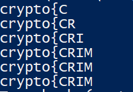

# CTRIME

## Đề bài
```python
from Crypto.Cipher import AES
from Crypto.Util import Counter
import zlib


KEY = ?
FLAG = ?


@chal.route('/ctrime/encrypt/<plaintext>/')
def encrypt(plaintext):
    plaintext = bytes.fromhex(plaintext)

    iv = int.from_bytes(os.urandom(16), 'big')
    cipher = AES.new(KEY, AES.MODE_CTR, counter=Counter.new(128, initial_value=iv))
    encrypted = cipher.encrypt(zlib.compress(plaintext + FLAG.encode()))

    return {"ciphertext": encrypted.hex()}
```

Đề bài sử dụng mô hình CTR để mã hóa plaintext + flag.

## Cách giải
Ta nhận thấy CTR là cipherstream nên độ dài ciphertext sẽ bằng plaintext, cùng với việc compress(nén) trước khi mã hóa nên nếu plaintext nhập vào trùng với flag thì zlib sẽ nén làm cho độ dài ciphertext ngắn đi.

Ý tưởng: Duyệt từng ký tự trong printable, nếu thấy độ dài ciphertext ngắn đi thì là ký tự đúng

Code:

```python
from Crypto.Util.number import *
import time
import requests
import string

base_url = 'https://aes.cryptohack.org/ctrime/encrypt/'

def getlen(plaintext):
    pt_hex = plaintext.encode().hex()
    url = base_url + pt_hex + '/'
    r = requests.get(url)
    data = r.json()
    ct = data['ciphertext']
    return len(ct)


flag = 'crypto{CRIME' 
cnt = getlen(flag)

while True:
    for c in string.printable:
        flag_test = flag + c
        tmp = getlen(flag_test)
        if cnt >= tmp:
            cnt = tmp
            flag += c
            break
    print(flag)
    if flag.endswith('}'):
        break
```

Lưu ý: Ta tìm được đoạn đầu là 'crypto{CRIM' sau đó bị kẹt do cách zlib nén, nhưng ta có thể dễ dàng đoán được ký tự tiếp theo là E để tiếp tục dò ký tự.

