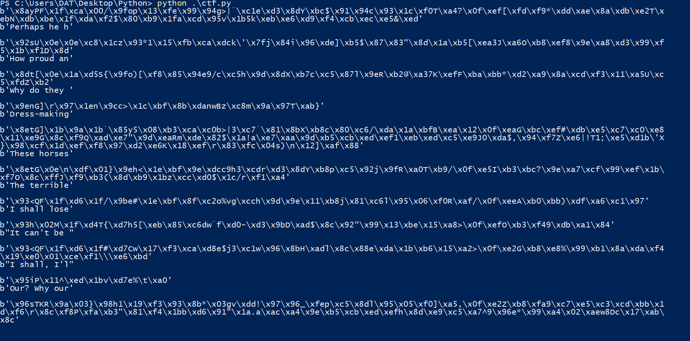

# Stream of Consciousness

## Đề bài
```python
from Crypto.Cipher import AES
from Crypto.Util import Counter
import random


KEY = ?
TEXT = ['???', '???', ..., FLAG]


@chal.route('/stream_consciousness/encrypt/')
def encrypt():
    random_line = random.choice(TEXT)

    cipher = AES.new(KEY, AES.MODE_CTR, counter=Counter.new(128))
    encrypted = cipher.encrypt(random_line.encode())

    return {"ciphertext": encrypted.hex()}
```

Đề bài sử dụng mô hình mã hóa CTR để mã hóa random 1 text bất kì trong list TEXT có chưa FLAG để trả về cho người dùng.

## Cách giải
Trước hết ta tìm tất cả các text có trong TEXT bằng hàm sau:
```python
def get_data():
    r = requests.get(url)
    data = r.json()
    return bytes.fromhex(data['ciphertext'])

def find_all_cipher():
    for i in range(30):
        cipher = get_data()
        if cipher not in cipherlist:
            cipherlist.append(cipher)
```

Vì $CT \oplus D(KEY) = PT$ với mọi TEXT nên ở đây D(KEY) không đổi do đó, $CT_{1} \oplus CT_{2} = PT_{1} \oplus PT_{2}$

Nếu ta xor ct của flag với ct 1 text, sau khi lấy kết quả xor với 'crypto{' ta sẽ được 7 kí tự đầu là từ hoặc đoạn có nghĩa, chính vì vậy, ta có thể tìm được ct của flag nhờ hàm sau:
```python 
def find_encrypted_flag():
    k = []
    for cipher in cipherlist:
        k = bytes([a ^ b for a, b in zip(flag, cipher)])
        check = 1
        for ct in cipherlist:
            tmp = bytes([a ^ b for a, b in zip(k, ct)])
            if not tmp[:7].decode().isprintable():
                check = 0
                break
        if check:
            return cipher, list(k[:7])
```

Việc này đồng thời giúp ta tìm được luôn 7 ký tự đầu của $D(KEY)$ (ta gọi tắt là key). Sau đó ta sẽ xor key với các ct của text và in ra độ dài tương ứng với độ dài đã tìm ra của key. Các đoạn văn bản sẽ được hiện ra dần dần, ta có thể in ra nhờ hàm sau:
```python
def print_all_cipher(k):
    for cipher in cipherlist:
        print(cipher)
        decrypted_cipher = bytes([a ^ b for a, b in zip(k, cipher)])
        print(decrypted_cipher[:len(k)])
        print()
```



Ta sẽ nhìn vào từng đoạn text và cố gắng đoán ký tự tiếp theo, thử với hàm add_key() và kiểm tra với các text còn lại:
```python
def add_key(cipher, c):
    next_k = cipher[len(key)] ^ ord(c)
    key.append(next_k)
```

Thử dần đến khi được flag

Full code:
```python
from Crypto.Util.number import *
import requests
import string

url = "https://aes.cryptohack.org/stream_consciousness/encrypt/"

cipherlist = []

flag = b'crypto{'

key = []

def get_data():
    r = requests.get(url)
    data = r.json()
    return bytes.fromhex(data['ciphertext'])

def find_all_cipher():
    for i in range(30):
        cipher = get_data()
        if cipher not in cipherlist:
            cipherlist.append(cipher)

def find_encrypted_flag():
    k = []
    for cipher in cipherlist:
        k = bytes([a ^ b for a, b in zip(flag, cipher)])
        check = 1
        for ct in cipherlist:
            tmp = bytes([a ^ b for a, b in zip(k, ct)])
            if not tmp[:7].decode().isprintable():
                check = 0
                break
        if check:
            return cipher, list(k[:7])

def print_all_cipher(k):
    for cipher in cipherlist:
        print(cipher)
        decrypted_cipher = bytes([a ^ b for a, b in zip(k, cipher)])
        print(decrypted_cipher[:len(k)])
        print()

def add_key(cipher, c):
    next_k = cipher[len(key)] ^ ord(c)
    key.append(next_k)

find_all_cipher()

encrypted_flag, key = find_encrypted_flag()

add_key(b'\x93<QF\x1f\xd6\x1f/\x9be#\x1e\xbf\x8f\xc2o%vg\xcch\x9d\x9e\x11\xb8j\x81\xc6l\x95\x06\xf0R\xaf/\x0f\xeeA\xb0\xbb)\xdf\xa6\xc1\x97', ' ')
add_key(b'\x98iV\x0e7\x9a\x04f\x9bfp\x08\xf7\x85\xc3*?f~\x8a', 'l')
add_key(b'\x98iV\x0e7\x9a\x04f\x9bfp\x08\xf7\x85\xc3*?f~\x8a', 'l')
add_key(b'\x98iV\x0e7\x9a\x04f\x9bfp\x08\xf7\x85\xc3*?f~\x8a', ' ')
add_key(b'\x8etG\x0e\n\xdf\x01}\x9eh<\x1e\xbf\x9e\xdcc9h3\xcdr\xd3\x8dY\xb8p\xc5\x92j\x9fR\xa0T\xb9/\x0f\xe5I\xb3\xbc?\x9e\xa7\xcf\x99\xef\x1b\xf7O\x8c\xffJ\xf9\xb3(\x8d\xb9\x1bz\xcc\xd0$\x1c/r\xf1\xa4', 'e')
add_key(b'\x96sTKR\x9a\x03}\x98h1\x19\xf3\x93\x8b*\x03gv\xdd!\x97\x96_\xfep\xc5\x8dl\x95\x05\xf0]\xa5,\x0f\xe2Z\xb8\xfa9\xc7\xe5\xc3\xcd\xbb\x1d\xf6\r\x8c\xf8P\xfa\xb3"\x81\xf4\x1bb\xd6\x91"\x1a.a\xac\xa4\x9e\xb5\xcb\xed\xefh\x8d\xe9\xc5\xa7^9\x96e*\x99\xa4\x02\xaew8Dc\x17\xab\x8c', 'l')
add_key(b'\x96sTKR\x9a\x03}\x98h1\x19\xf3\x93\x8b*\x03gv\xdd!\x97\x96_\xfep\xc5\x8dl\x95\x05\xf0]\xa5,\x0f\xe2Z\xb8\xfa9\xc7\xe5\xc3\xcd\xbb\x1d\xf6\r\x8c\xf8P\xfa\xb3"\x81\xf4\x1bb\xd6\x91"\x1a.a\xac\xa4\x9e\xb5\xcb\xed\xefh\x8d\xe9\xc5\xa7^9\x96e*\x99\xa4\x02\xaew8Dc\x17\xab\x8c', 'y')
add_key(b'\x8ayPF\x1f\xca\x00/\x9fop\x13\xfe\x99\x94g>|`\xc1e\xd3\x8dY\xbc$\x91\x94c\x93\x1c\xf0T\xa4?\x0f\xef[\xfd\xf9*\xdd\xae\x8a\xdb\xe2T\xebN\xdb\xbe\x1f\xda\xf2$\x80\xb9\x1fa\xcd\x95v\x1b5k\xeb\xe6\xd9\xf4\xcb\xec\xe5&\xed', ' ')
add_key(b'\x8etPK\x1b\x9a\x11`\x8eyp\t\xea\x84\xdac9h?\x84q\x9f\x98H\xb0j\x82\xc6c\x8eR\xb8Z\xb8(J\xf5\x04\xfd\xc8.\xcc\xbc\xc5\xc3\xf3\x15\xa4', 'i')
add_key(b'\x8etPK\x1b\x9a\x11`\x8eyp\t\xea\x84\xdac9h?\x84q\x9f\x98H\xb0j\x82\xc6c\x8eR\xb8Z\xb8(J\xf5\x04\xfd\xc8.\xcc\xbc\xc5\xc3\xf3\x15\xa4', 'n')
add_key(b'\x8etPK\x1b\x9a\x11`\x8eyp\t\xea\x84\xdac9h?\x84q\x9f\x98H\xb0j\x82\xc6c\x8eR\xb8Z\xb8(J\xf5\x04\xfd\xc8.\xcc\xbc\xc5\xc3\xf3\x15\xa4', 'g')
add_key(b'\x8ayPF\x1f\xca\x00/\x9fop\x13\xfe\x99\x94g>|`\xc1e\xd3\x8dY\xbc$\x91\x94c\x93\x1c\xf0T\xa4?\x0f\xef[\xfd\xf9*\xdd\xae\x8a\xdb\xe2T\xebN\xdb\xbe\x1f\xda\xf2$\x80\xb9\x1fa\xcd\x95v\x1b5k\xeb\xe6\xd9\xf4\xcb\xec\xe5&\xed', 's')
add_key(b'\x8ayPF\x1f\xca\x00/\x9fop\x13\xfe\x99\x94g>|`\xc1e\xd3\x8dY\xbc$\x91\x94c\x93\x1c\xf0T\xa4?\x0f\xef[\xfd\xf9*\xdd\xae\x8a\xdb\xe2T\xebN\xdb\xbe\x1f\xda\xf2$\x80\xb9\x1fa\xcd\x95v\x1b5k\xeb\xe6\xd9\xf4\xcb\xec\xe5&\xed', 'e')
add_key(b'\x8ayPF\x1f\xca\x00/\x9fop\x13\xfe\x99\x94g>|`\xc1e\xd3\x8dY\xbc$\x91\x94c\x93\x1c\xf0T\xa4?\x0f\xef[\xfd\xf9*\xdd\xae\x8a\xdb\xe2T\xebN\xdb\xbe\x1f\xda\xf2$\x80\xb9\x1fa\xcd\x95v\x1b5k\xeb\xe6\xd9\xf4\xcb\xec\xe5&\xed', 'd')
add_key(b'\x8ayPF\x1f\xca\x00/\x9fop\x13\xfe\x99\x94g>|`\xc1e\xd3\x8dY\xbc$\x91\x94c\x93\x1c\xf0T\xa4?\x0f\xef[\xfd\xf9*\xdd\xae\x8a\xdb\xe2T\xebN\xdb\xbe\x1f\xda\xf2$\x80\xb9\x1fa\xcd\x95v\x1b5k\xeb\xe6\xd9\xf4\xcb\xec\xe5&\xed', ' ')
add_key(b'\x93<QF\x1f\xd6\x1f/\x9be#\x1e\xbf\x8f\xc2o%vg\xcch\x9d\x9e\x11\xb8j\x81\xc6l\x95\x06\xf0R\xaf/\x0f\xeeA\xb0\xbb)\xdf\xa6\xc1\x97', 'g')
add_key(b'\x93<QF\x1f\xd6\x1f/\x9be#\x1e\xbf\x8f\xc2o%vg\xcch\x9d\x9e\x11\xb8j\x81\xc6l\x95\x06\xf0R\xaf/\x0f\xeeA\xb0\xbb)\xdf\xa6\xc1\x97', ' ')
add_key(b'\x96sTKR\x9a\x03}\x98h1\x19\xf3\x93\x8b*\x03gv\xdd!\x97\x96_\xfep\xc5\x8dl\x95\x05\xf0]\xa5,\x0f\xe2Z\xb8\xfa9\xc7\xe5\xc3\xcd\xbb\x1d\xf6\r\x8c\xf8P\xfa\xb3"\x81\xf4\x1bb\xd6\x91"\x1a.a\xac\xa4\x9e\xb5\xcb\xed\xefh\x8d\xe9\xc5\xa7^9\x96e*\x99\xa4\x02\xaew8Dc\x17\xab\x8c', "'")
add_key(b'\x96sTKR\x9a\x03}\x98h1\x19\xf3\x93\x8b*\x03gv\xdd!\x97\x96_\xfep\xc5\x8dl\x95\x05\xf0]\xa5,\x0f\xe2Z\xb8\xfa9\xc7\xe5\xc3\xcd\xbb\x1d\xf6\r\x8c\xf8P\xfa\xb3"\x81\xf4\x1bb\xd6\x91"\x1a.a\xac\xa4\x9e\xb5\xcb\xed\xefh\x8d\xe9\xc5\xa7^9\x96e*\x99\xa4\x02\xaew8Dc\x17\xab\x8c', 't')
add_key(b'\x96sTKR\x9a\x03}\x98h1\x19\xf3\x93\x8b*\x03gv\xdd!\x97\x96_\xfep\xc5\x8dl\x95\x05\xf0]\xa5,\x0f\xe2Z\xb8\xfa9\xc7\xe5\xc3\xcd\xbb\x1d\xf6\r\x8c\xf8P\xfa\xb3"\x81\xf4\x1bb\xd6\x91"\x1a.a\xac\xa4\x9e\xb5\xcb\xed\xefh\x8d\xe9\xc5\xa7^9\x96e*\x99\xa4\x02\xaew8Dc\x17\xab\x8c', ' ')
add_key(b'\x93<QF\x1f\xd6\x1f#\xd7Cw\x17\xf3\xca\xd8e$j3\xc1w\x96\x8bH\xadl\x8c\x88e\xda\x1b\xb6\x15\xa2>\x0f\xe2G\xb8\xe8%\x99\xb1\x8a\xda\xf4\x19\xe0\x01\xce\xf1\\\xe6\xbd', 'n')
add_key(b'\x93<QF\x1f\xd6\x1f#\xd7Cw\x17\xf3\xca\xd8e$j3\xc1w\x96\x8bH\xadl\x8c\x88e\xda\x1b\xb6\x15\xa2>\x0f\xe2G\xb8\xe8%\x99\xb1\x8a\xda\xf4\x19\xe0\x01\xce\xf1\\\xe6\xbd', 'g')
add_key(b'\x96sTKR\x9a\x03}\x98h1\x19\xf3\x93\x8b*\x03gv\xdd!\x97\x96_\xfep\xc5\x8dl\x95\x05\xf0]\xa5,\x0f\xe2Z\xb8\xfa9\xc7\xe5\xc3\xcd\xbb\x1d\xf6\r\x8c\xf8P\xfa\xb3"\x81\xf4\x1bb\xd6\x91"\x1a.a\xac\xa4\x9e\xb5\xcb\xed\xefh\x8d\xe9\xc5\xa7^9\x96e*\x99\xa4\x02\xaew8Dc\x17\xab\x8c', 'o')
add_key(b'\x96sTKR\x9a\x03}\x98h1\x19\xf3\x93\x8b*\x03gv\xdd!\x97\x96_\xfep\xc5\x8dl\x95\x05\xf0]\xa5,\x0f\xe2Z\xb8\xfa9\xc7\xe5\xc3\xcd\xbb\x1d\xf6\r\x8c\xf8P\xfa\xb3"\x81\xf4\x1bb\xd6\x91"\x1a.a\xac\xa4\x9e\xb5\xcb\xed\xefh\x8d\xe9\xc5\xa7^9\x96e*\x99\xa4\x02\xaew8Dc\x17\xab\x8c', 'w')
add_key(b'\x9esNB\x07\x9a\x04f\x9bfp\x0f\xf7\x83\xdaaw{{\xc5u\xd3\xb0\x16\xb4$\x89\x83c\x8c\x1b\xbeR\xea:\x0f\xf5M\xbe\xf4%\xda\xe5\xc2\xcc\xe8\x16\xe4O\xc8\xb0^\xe3\xf7j\x80\xf1\x13z\x9f\x84>\x162c\xe4\xe5\xc2\xf0\x9f\xcc\xaa%\xb9\xec\xd4\xe9X)\xc4a(\x84\xa4\x03\xa3>=N1\x06\xad\xc7*1F~\xd6\xc6V', 'n')
add_key(b'\x9esNB\x07\x9a\x04f\x9bfp\x0f\xf7\x83\xdaaw{{\xc5u\xd3\xb0\x16\xb4$\x89\x83c\x8c\x1b\xbeR\xea:\x0f\xf5M\xbe\xf4%\xda\xe5\xc2\xcc\xe8\x16\xe4O\xc8\xb0^\xe3\xf7j\x80\xf1\x13z\x9f\x84>\x162c\xe4\xe5\xc2\xf0\x9f\xcc\xaa%\xb9\xec\xd4\xe9X)\xc4a(\x84\xa4\x03\xa3>=N1\x06\xad\xc7*1F~\xd6\xc6V', 'g')
add_key(b'\x9esNB\x07\x9a\x04f\x9bfp\x0f\xf7\x83\xdaaw{{\xc5u\xd3\xb0\x16\xb4$\x89\x83c\x8c\x1b\xbeR\xea:\x0f\xf5M\xbe\xf4%\xda\xe5\xc2\xcc\xe8\x16\xe4O\xc8\xb0^\xe3\xf7j\x80\xf1\x13z\x9f\x84>\x162c\xe4\xe5\xc2\xf0\x9f\xcc\xaa%\xb9\xec\xd4\xe9X)\xc4a(\x84\xa4\x03\xa3>=N1\x06\xad\xc7*1F~\xd6\xc6V', ' ')

print_all_cipher(key)
```